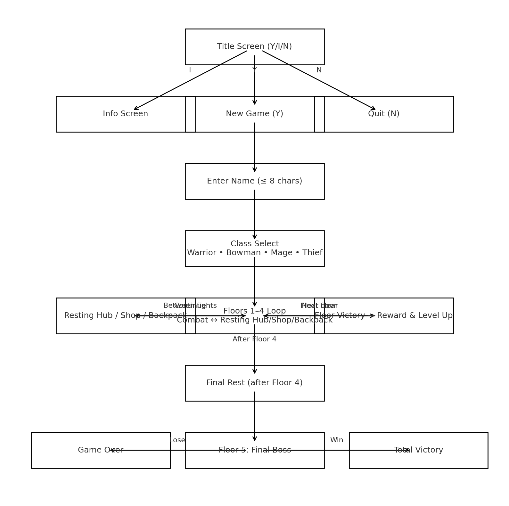

# Tower of Power

A retro, turn-based ASCII roguelike where you climb through multiple floors of enemies, bosses, and shops to conquer the **Tower of Power**. Choose a class, master your abilities, manage your resources, and survive to the top — all in your terminal.

---

## 🎮 Gameplay Overview

**Tower of Power** is a single‑player text RPG played entirely in the terminal.

You will:
- Create a character from one of **four classes** — **Warrior**, **Bowman**, **Mage**, or **Thief** — each with unique mechanics.
- Progress through **five floors**, each with enemies, challenges, and rewards.
- Manage **HP**, **Energy**, **Coins**, and **Consumables** strategically.
- Visit **shops** and **resting hubs** between fights to prepare.
- Face the **Final Boss** to claim total victory.

---

## 🧮 Core Stats

| Stat | Effect |
|---|---|
| **STR** | Increases **critical damage** |
| **DEX** | Increases **dodge chance** |
| **INT** | Increases **damage mitigation** (defense) |
| **LUK** | Increases **critical hit chance** |

---

## 🏹 Classes

- **Warrior** — Heavy-hitting melee fighter with strong crits.  
- **Bowman** — Ranged attacker with accuracy **pips** that build during combat.  
- **Mage** — Elementalist able to switch between **Fire** 🔥 and **Ice** ❆.  
- **Thief** — Agile attacker who builds **gouge counters** for burst damage.

---

## 🗺️ Progression Loop

1. **Floors 1–4** — Enemies → floor reward → **level up** (allocate stats).  
2. **Resting Hubs** — Safe rooms to access the **Shop** or your **Backpack**.  
3. **Final Rest** — A breather between Floor 4 and the **Final Boss**.  
4. **Floor 5** — **Final Boss**. Win to achieve **Total Victory**.

### Flowchart



> The loop alternates between **combat** and **rest/shop/backpack** management, with rewards and level-ups after floor clears.

---

## 🛒 Shop Items (examples)

- **Full Heal** — Restore all HP  
- **Full Energy** — Restore all energy  
- **Basic / Greater Potions** — Partial HP recovery  
- **Basic / Greater Energy Potions** — Partial energy recovery  

---

## ⚔️ Combat & Inventory

- Turn-based combat. Choose basic attacks, **class abilities**, or **items**.  
- Abilities often cost **energy**.  
- Status mechanics (accuracy pips, elemental toggles, gouge counters) are **class-specific**.  
- Your **Backpack** holds consumables for use during or between fights.

---

## 🧑‍💻 How to Run

### Requirements
- Python 3.x

### Start the game
```bash
python app.py
```

> The game runs in the terminal. Follow the on-screen prompts (e.g., `Y/N`, `1/2/3/4`).

---

## 📁 Project Structure

```
.
├── app.py            # Main game loop and orchestration
├── TitleScreen.py    # UI rendering and menu flows
└── Assets/           # Game logic: player creation, floors, equipment, enemies (not included here)
```

---

## 🧭 Design Notes

- **UI** is pure print/input for maximum portability.  
- **Game state** lives in the Player object created in `Assets/newPlayer`.  
- **Floor progression** is tracked via flags to avoid duplicate rewards.

---

## 🛠️ Future Ideas

- Save/load system (JSON snapshot of player state)  
- Difficulty settings & more classes/enemies  
- Config-driven rewards/shops (tables instead of magic numbers)  
- State-machine combat loop for multi-phase bosses

---

## 📝 License

MIT or your preferred open-source license.
